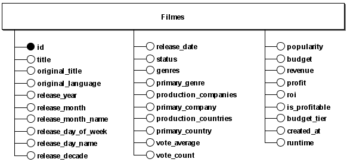
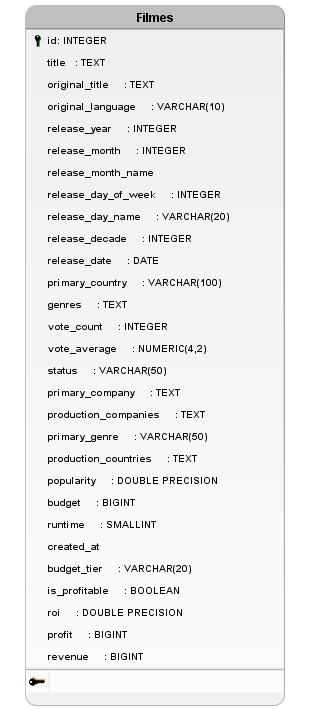

# Modelo Entidade-Relacionamento (MER), DER e DLD

## Projeto: TMDB Movies Dataset - Camada Silver

## MODELO ENTIDADE-RELACIONAMENTO (MER)

O Modelo Entidade-Relacionamento (MER) é uma representação conceitual dos dados de um domínio. Ele descreve entidades, seus atributos e os relacionamentos entre elas.

### MER do Projeto (Camada Silver)

#### Entidades
- **TB_FILMES_SILVER**

#### Atributos

TB_FILMES_SILVER(<u>id</u>, title, original_title, original_language, release_date, release_year, release_month, release_month_name, release_day_of_week, release_day_name, release_decade, runtime, status, genres, primary_genre, production_companies, primary_company, production_countries, primary_country, vote_average, vote_count, popularity, budget, revenue, profit, roi, is_profitable, budget_tier, created_at)

#### Relacionamentos
- Não possui (modelo desnormalizado para análise)

> **Nota:** Na camada Silver adotamos uma tabela única (estilo lakehouse) para consumo analítico, por isso o MER possui apenas uma entidade e nenhum relacionamento explícito entre entidades.

## DIAGRAMA ENTIDADE-RELACIONAMENTO (DER)

O Diagrama Entidade-Relacionamento (DER) é uma representação gráfica do modelo de dados em nível conceitual. Foca em entidades e seus atributos, sem detalhar aspectos de implementação física.

### DER Conceitual do Projeto (Camada Silver)

## DIAGRAMA LÓGICO DE DADOS (DLD)

O Diagrama Lógico de Dados descreve a estrutura lógica do banco: tabelas, colunas, tipos, chaves e constraints. Ele detalha como o modelo conceitual é representado logicamente.

### DLD do Projeto (Camada Silver)

### Constraints

| Tipo | Nome | Descrição |
|------|------|-----------|
| PRIMARY KEY | filmes_pkey | Chave primária na coluna `id` |

### Índices

| Índice | Colunas | Justificativa |
|--------|---------|---------------|
| idx_filmes_release_year | release_year | Consultas por ano de lançamento |
| idx_filmes_primary_genre | primary_genre | Filtragem por gênero |
| idx_filmes_vote_average | vote_average | Ordenação por avaliação |
| idx_filmes_popularity | popularity | Ordenação por popularidade |
| idx_filmes_budget_tier | budget_tier | Análise por faixa orçamentária |